# 185 WAREHOUSING: inventory management web application

## URL to published app
http://185warehouse.netlify.com/

## Link to GitHub repository
(Ensure the repo is accessible by your Educators)
https://github.com/SkyTradeInc/185server
https://github.com/SkyTradeInc/185client
 

##Link to testing documentation
https://docs.google.com/spreadsheets/d/1asE7NA2jZRU8z5RR7gAYKJsP9TccN83xVbpgQ-chCI8/edit?usp=sharing

Client testing took place at the warehouse utilising the handheld barcode scanner and the app running locally on his computer.
Here is an image of our team on location with the client testing the production version of the 185 warehousing inventory application.

##Link to API documentation
- This API documentation also acted as our testing platform as it shows the outcome.
https://documenter.getpostman.com/view/5312272/RztisVWx

# 185 WAREHOUSING: inventory management web application 
## Problem definition / purpose
The purpose of this web application is to build a warehouse management system for 185 Warehousing that will enable them to scale back on the paper and pen manual input that is currently involved.
185 Warehousing is the product distributor for CHHL (Cricket & Hockey Holdings Ltd).  

The issues this application aims to solve are:
* Every step of the 185 process is manual. Counting in, sending out, stocktake is all pen and paper and re-entered into the computer.

* Pen and paper picking allows for manual error.

* Invoicing for each job requires manual (re) entry.

* 185 has no independent record of stock on hand and/or stock movement. For example if the client (CHHL) says 185 should have 8 units of product ‘x’, 185 has no independent systemised way of showing product movement.
  
* Additional 2-3 hours of manual entering each week (peak periods) to get capture the information in the Reckon finance software.

## Functionality / features
* User and authentication for multiple user roles including user management for those with admin rights.
* Barcode scanning capabilities.
* CRUD functionality for product stock levels.
* 

## Screenshots
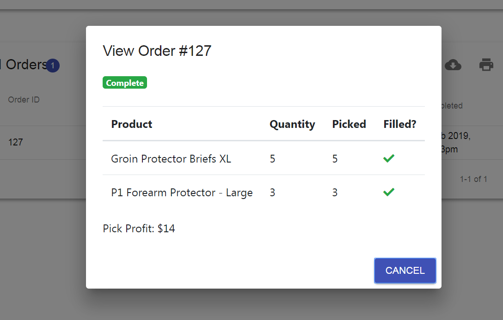
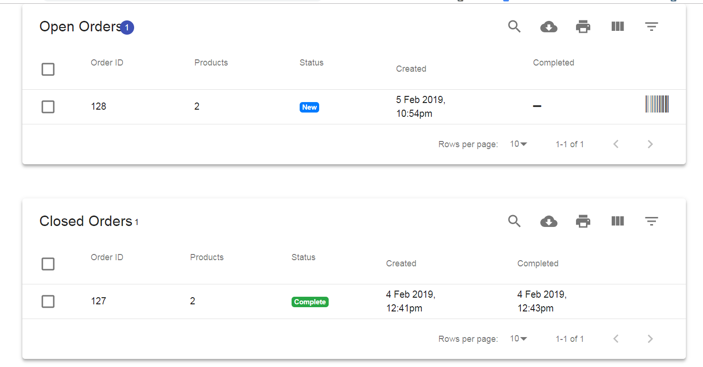
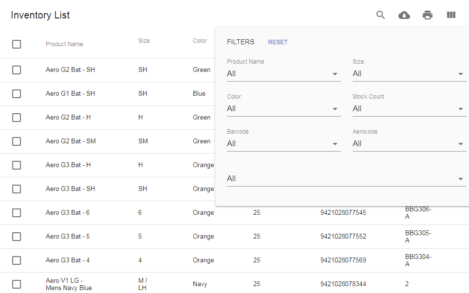
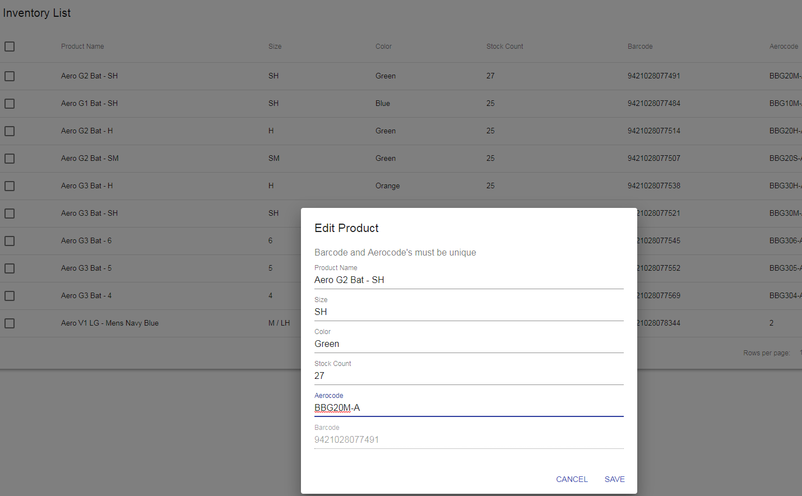
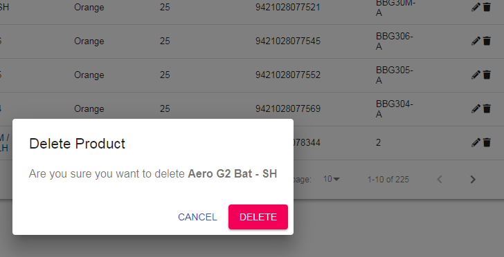
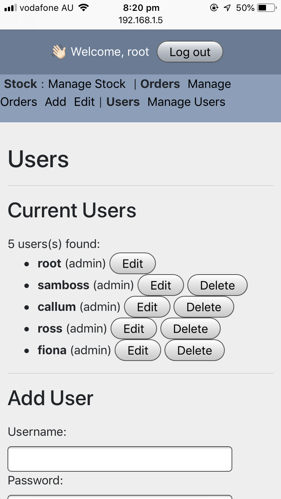
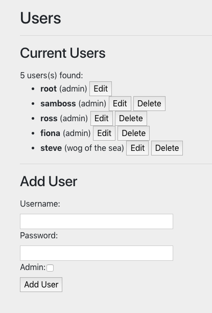

## Tech stack (e.g. html, css, deployment platform, etc)
- Mongo / Mongoose
- Express
- React.js
- Node.js
- Socket.IO
- HTML
- CSS
- mLab
- Heroku
- Netlify
  

# Instructions on how to setup, configure, deploy and use app.
* Git clone both 185client and 185server
* Then in terminal, type npm i
* To view the code in VS Code, type code . into terminal, or to view current code locally, type npm start.
* Utilise a service such as netlify to deploy using the instructions that can be found in the netlify docs.
* Once a URL has been established (feel free to use the one we prepared earlier http://185warehouse.netlify.com/ ) go to the URL and view product.

# Design documentation
## Design process
* We chose a functional site over a beautiful design.
* We looked at other inventory management systems to guide our user and data flow.

## User stories
INVENTORY
* As a user I would like to scan items as they come into the warehouse which updates my current inventory stock level. (Option to scan one at a time or enter a quantity # for large orders).
*  As a user I want an automatically-updated stock inventory list available to send instantly to CHHL / have on hand for personal reference.
* If an item in stock is no longer being sold by CHHL I want to be able to remove this item from the database search but still have the item in the database for record purposes
---------------------------------------------
OUTBOUND STOCK
* As a user I want to manually add each item to an outgoing order list on the computer. I want to be able to select that I want to begin collecting the items for this order, then scan each item which will automatically be added to the outgoing order until all items are collected and I can confirm ready to dispatch. (Larger item orders e.g. 73 pairs of socks will have a "select quantity" option).
* To counter human-error, I would like the phone to show a "wrong item" error message if the item scanned is not part of that outgoing order.
* If an item(s) in this outgoing order are not in stock, I want to be able to still confirm the order and have this order status as unfinished.
* If an item(s) in this order have been discontinued, I want to be able to cancel that item from this list.
----------------------------------------------
INBOUND STOCK
* I want to be able to scan each item which has come in to the warehouse which will automatically added to the system stock levels. I want to be able to select the quantity amount rather then scan each item if a large amount of stock has come in.
* I want to be able to scan a brand new item and be presented with a form to fill out with all the information needed to add this item to the database. All subsequent scans can increase the quantity level of this item.

## Wireframes, workflow, data flow diagram

## Database Entity Relationship Diagrams
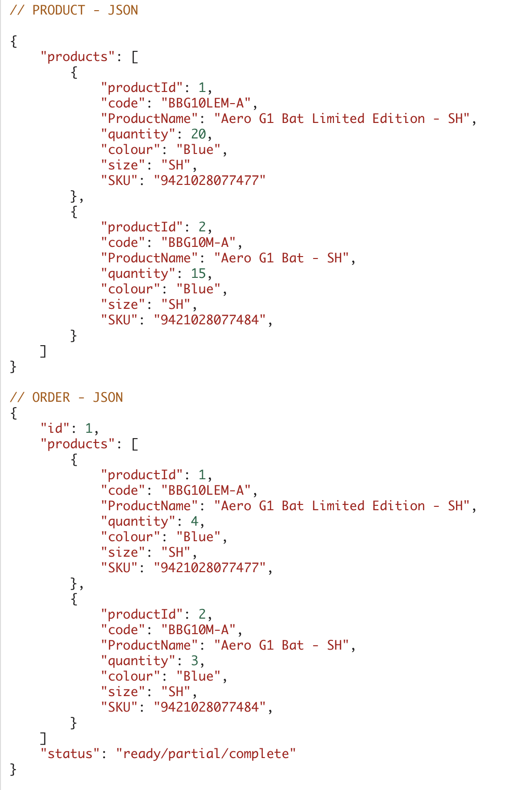

# Design documentation: details of project management & planning process:
## Project plan & timeline
Week 1 of 4:
* Get brief from client
* Build basic wireframes
* Setup database schema
* Complete user stories
* Get project signed off

Week 2 of 4:
* Finalise wireframes
* Set up models, routes and server
* Investigate barcode scanning
* Deploy backend

Week 3 of 4:
* Hit MVP
* Deploy back end
* Visit client for testing
* Deploy front end

Week 4 of 4:
* Testing
* Final styling
* Any additional features beyond MVP
* Project submission Thurs 7th Feb.

## Client communications
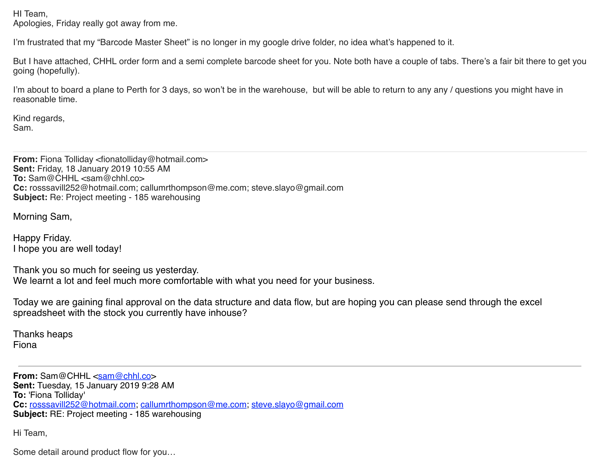

## Screenshot of Trello board(s)
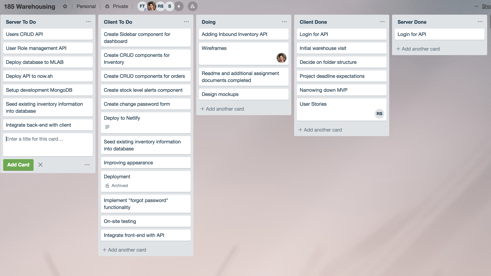
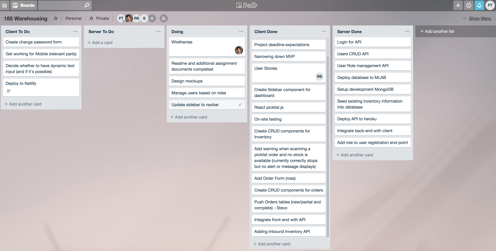

# Short Answer questions (Section 2.2)
## a) What are the most important aspects of quality software?
The Consortium for IT Software Quality (CISQ) has identified five aspects to creating quality software, despite this topic being a subject of contention among different peoples perspectives.

The five aspects identified by the CISQ are:
- Reliability: which is basically the probability of success of the software.  It measures the risk and likelihood of potential failures.  The goal to reliable software is to prevent application downtime, outages and errors that directly affect users.
- Efficiency: The source code affects the efficiency of applications and needs to be written to provide speed where speed is required.  Efficiency is especially important for applications in high execution speed environments such as algorithmic or transactional processing where performance and scalability are paramount.
- Security: This is a measure of the likelihood of potential security breaches due to poor coding practices and architecture.
- Maintainability: Maintainability realates to change and adaptability, portability and transferability (from one development team to another). 
- Size: While not a quality attribute per se, the sizing of source code is a software characteristic that obviously impacts maintainability. Combined with the above quality characteristics, software size can be used to assess the amount of work produced and to be done by teams, as well as their productivity through correlation with time-sheet data, and other SDLC-related metrics.

## b) What libraries are being used in the app and why?
- Socket.IO: works for realtime web applications that require live data streaming between the client and the server.  We have used socket.IO to keep a constant open connection to the API and database in order to allow real time updates from our barcode scanner.
- Express JS: used for server management by listening for any input/connection requests from the browser. 
- Mongoose: this is a Object Data Modeling libriray for mongo db management.
It manages relationships between data, provides schema validation, and is used to translate between objects in code and the representation of those objects in MongoDB.
- Axios makes HTTP requests to be used in the front and back end applications.
- CORS (cross origin resource sharing) allows cross communication between the browser and API.
- JSON web tokens allow claims, such as user data, to be represented in a secure manner.
- Regex stands for regular expression and is a special text string for describing a search pattern. A regex search actually scours each page in the search domain character-by-character  In our project, regex has been used in our product search and matches the characters to the products in the database. 
- Material-UI is a design language developed by Google and is somewhat similar to Bootstrap. We have used it to assist with responsiveness and layout.
- Bootstrap is the other design language that we have used for styling.

## c) A team is about to engage in a project, developing a website for a small business. What knowledge and skills would they need in order to develop the project?
- A thorough understanding of the business and the pain points that need to be solved.
- Good time management and planning skills.
- Good communication skills.
- Knowledge of coding and design.
- Excellent googling skills.
- Commit often to github. Push a branch, create a pull request, have it approved by another team mate and if merge conflicts occur, mitigate them as a team.

## d) Within your own project what knowledge or skills were required to complete your project, and overcome challenges?
- Knowledge and understanding of the MERN stack.
- Knowledge and understanging of deployment.
- An understanding of CHHL, the 185 warehousing business and how orders are processed and packed.
- Understanding of how to use barcode scanning npm packages vs. just using a handhold scanner.
- Learning how to test the site.

## e) Evaluate how effective your knowledge and skills were for this project, using examples, and suggest changes or improvements for future projects of a similar nature?
As a team, we all found React to be quite challenging.  
Applying this.state as well as the lifecycle methods required a lot of additional reading to ensure everything worked effectively.

The majority of the team had no previous exposure to regular expressions or sockets, so there was a big learning curve there which also enabled more strategic ways of thinking.

There were no issues with communication within our team.  We had synergistic collaboration and openly challenged each other to meet more ambitious milestones within ambitious timings.

